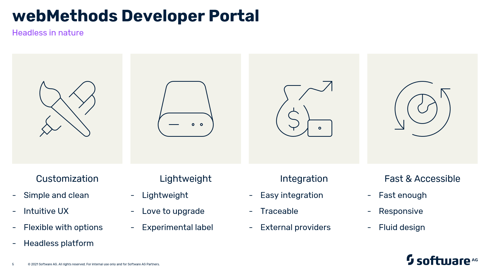

webMethods Developer Portal
==========================
webMethods Developer Portal is a platform for securely exposing APIs to the partners, app developers. It is a marketplace for API Businesses to drive growth.

webMethods Developer Portal provides a functional rich API support to build your business on top of the platform. You can expose and engage with your app developers more easily and monitor your APIs trends and analytics.  It is a white label solution. So that you can completely customize the look and feel and connect the audience with your brand identity.

Getting started
---------------
x

What is new?
-----------
x

______________________
These tools are provided as-is and without warranty or support. They do not constitute part of the Software AG product suite. Users are free to use, fork and modify them, subject to the license agreement. While Software AG welcomes contributions, we cannot guarantee to include every contribution in the master project.
