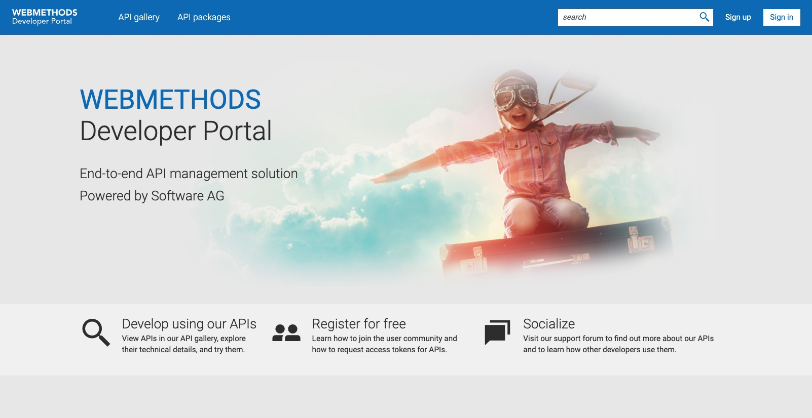
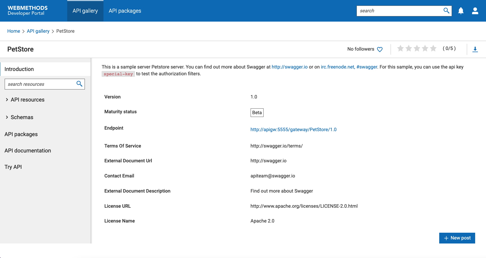

webMethods Developer Portal
==========================
webMethods Developer Portal is a platform for securely exposing APIs to the partners, app developers. It is a marketplace for API Businesses to drive growth.

webMethods Developer Portal provides a functional rich API support to build your business on top of the platform. You can expose and engage with your app developers more easily and monitor your APIs trends and analytics.  It is a white label solution. So that you can completely customize the look and feel and connect the audience with your brand identity.

High level features of webMethods Developer Portal:

* Light weight, microservices based architecture
* Headless nature aka Build Your Own Portal
* Extensible and pluggable
* Webhooks to generate actionable events
* Rich customization capabilities
* Compatible with third-party gateways and APIs
* Developers’ Portal for any kind of asset

Get webMethods Developer Portal
-------------------------------
webMethods Developer Portal can be provisioned in multiple ways based on the users' needs. Choose the one which works the best for you. 

[WEBMETHODS.io](https://www.softwareag.cloud/site/product/webmethods-api.html) -  A 30 day free trial cloud account can be provisioned in less than 15 minutes. Visit SoftwareAG cloud and get your instance running in a region of your choice.

[Docker](https://hub.docker.com/r/softwareag/devportal) - A 90 day free trial version of Developer Portal docker image can be pulled from the docker hub.

Get started
---------------
Now that you provisioned the Developer Portal, it's time to explore the product capabilities.

Here's what it looks like after logging in to your cloud or deploying the Developer Portal container.

**Creating an API**

1. Click on the menu options on the upper right and click Manage APIs.

2. Click create API

3. Provide Petstore in the Name field

4. Select Swagger from the Type list

5. Select External in the Provider field

6. Select URL radiobutton under Import With

7. Provide https://petstore.swagger.io/v2/swagger.json for the URL

Congratulations, you have successfully created your first API in the Developer Portal

**Navigating and trying out APIs**

Now that you created your first API, let's take a look at its details.

1. Click on API Gallery in the top ribbon

2. Click on the Petstore API that you just created

3. Click on API resources, /pet/findByStatus, and GET findPetsByStatus

4. Scroll through the page to see its parameters, responses, payload schema, and a sample response

5. Click on Try next to sample request

6. Type "available" under Value and click Send

7. You will get all available pets

8. Take your time to browse through its resources and schemas

This is what the API Details page looks like

**Customize the look of your Developer Portal**

webMethods Developer Portal offers rich features to design your portal to reflect your brand identity. This is done through customizable themes.

1. Download one of the themes from [here](https://github.com/SoftwareAG/webmethods-developer-portal/tree/main/samples/themes)

2. In the Developer Portal, go to the menu options on the upper right, click on Administration

3. Click on Manage Themes on the left

4. Click restore and select the theme you downloaded

5. Click on the checkmark next to the theme to activate that theme

6. When you refresh the page, you will see your changes in effect

7. Feel free to make other modifications to the theme by clicking on the pencil icon in the Manage themes screen to customize

webMethods API Gateway
----------------------
webMethods Developer Portal can be used with any 3rd party API. However, in order to take full advantage of the webMethods API Management Suite, you can try pairing it with [webMethods API Gateway](https://github.com/SoftwareAG/webmethods-api-gateway).
______________________
These tools are provided as-is and without warranty or support. They do not constitute part of the Software AG product suite. Users are free to use, fork and modify them, subject to the license agreement. While Software AG welcomes contributions, we cannot guarantee to include every contribution in the master project.
