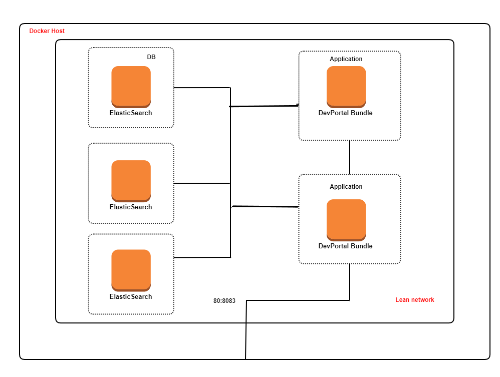

 ### To deploy a cluster of developer portal with elasticsearch

`docker-compose up`

* Once containers are up the developer portal for a container, devportal_0 will be exposed in 8083 (http) and 8084 (https) & devportal_1 will be exposed in 8085 (http) and 8086 (https)
* You can have external load balancer between 8083 and 8085 & 8084 and 8086 to balance the UI traffic

 ### Docker compose internally does the following operations

   * It creates a network called "devportal-nw" which will be used for communication between Elasticsearch and Developer Portal
   * It brings up a three container of Elasticsearch version 7.13.1 named "devportal-es-0", "devportal-es-1" and "devportal-es-2"
   * It brings up a single container of DevPortal Bundle named "devportal_0" and "devportal_1"
