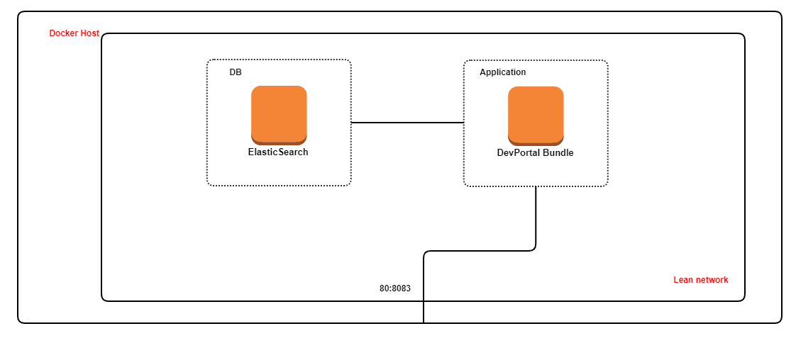

 ### To deploy a single node developer portal with elasticsearch
    
`docker-compose up`
  
 ### Docker compose internally does the following operations

   * It creates a network called "devportal-nw" which will be used for communication between Elasticsearch and Developer Portal
   * It brings up a single container of Elasticsearch version 8.2.3 named "devportal-es" 
   * It brings up a single container of DevPortal Bundle named "devportal" which expose the port 80 and 443 to outer world