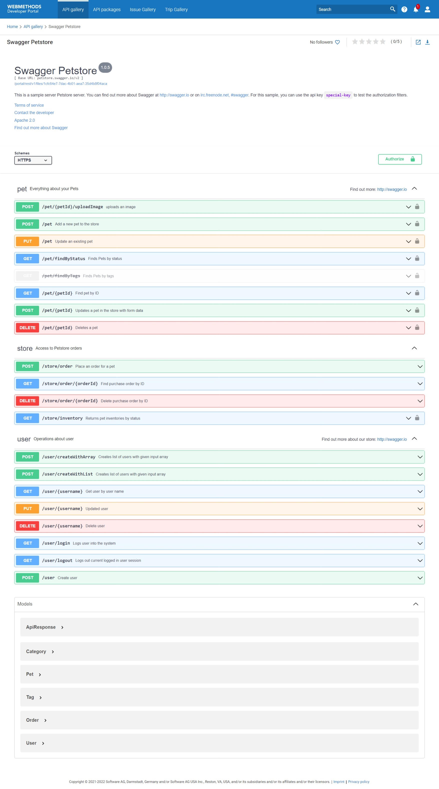

Web Components in Developer Portal 
===========================

Web components are a set of web platform APIs that allow you to create new custom, reusable,
encapsulated HTML tags to use in web pages.

You can use web components to add customized components and widgets to your portal.

How to use web components for UI customization
============================================

### 1. Create a web component as single javascript file

   1. Please follow the instructions available in the individual web component readme file to generate the web component as a single JS file.
      ***Example***: To generate the api-gallery-box web component, refer [api-gallery-box README](api-gallery-box/README.md)
   

### 2. Register a web component

   1. Login as Administrator
   2. Navigate to Administration -> Themes
   3. Click `customize` icon from the list of themes which you want to customize
   4. In the left navigation, choose `Web Components` section
   5. Register the web component with the details - `Name`, `Description` and the file created in the first step.

### 3. Insert a web component in UI

The registered web component can be inserted to any pages available under pages section. To insert the web component in a particular page,

   1. Select the page where the web component to be rendered using `Left navigation` -> `Pages` section.
   2. Select any layout in the page. Add `Web component` using (+) icon where the web component to be inserted.
   3. Select the added web component, Click `Edit' icon. 
   4. From the `Name` dropdown, select the the name of the web component defined in the second step. 
   5. Now, fill in the `Element name` text field with element name mentioned in the individual web component readme file.
      ***Example***: Fill in `wc-js-google-analytics` as element name for Google Analytics Integration.
   6. Save the changes and activate the theme.

Web components considerations
=============================

Remember the following points when creating web components:
   1. Use unique element names.
   2. The JavaScript file uploaded for a web component must be independent of other files. There should not be any dependency between the uploaded files.
   3. Element name should have an hyphen (-) based on custom element specification. For example, api-gallery-item

Built-in webcomponents that can be used in the Developer Portal.
==================================================================

| # | Name |  Element | Image      | Link |
|---| ---- | -------- |----------- | ---- |
| 1 | Google Analytics Integration | wc-js-google-analytics |  | [View](https://github.com/SoftwareAG/webmethods-developer-portal/raw/main/samples/web-components/google-analytics/src/js/google-analytics.js) |
| 2 | Simple heading | custom-heading |  | [View](https://github.com/SoftwareAG/webmethods-developer-portal/tree/main/samples/web-components/heading) |
| 3 | Simple banner  | custom-banner |  | [View](https://github.com/SoftwareAG/webmethods-developer-portal/tree/main/samples/web-components/banner) |
| 4 | Customized gallery  | api-gallery-with-filter |  | [View](https://github.com/SoftwareAG/webmethods-developer-portal/tree/main/samples/web-components/api-gallery-with-filter) |
| 5 | Customized API box  | api-gallery-box |  | [View](https://github.com/SoftwareAG/webmethods-developer-portal/tree/main/samples/web-components/api-gallery-box) |
| 6 | API box with i18n switch  | api-gallery-i18ninfo |  | [View](https://github.com/SoftwareAG/webmethods-developer-portal/tree/main/samples/web-components/api-gallery-i18n) |
| 7 | Group by with API Gallery  | api-gallery-grouped |  | [View](https://github.com/SoftwareAG/webmethods-developer-portal/tree/main/samples/web-components/api-gallery-grouped) |
| 8 | Youtube video embed  | wc-youtube |  | [View](https://github.com/SoftwareAG/webmethods-developer-portal/tree/main/samples/web-components/youtube-video) |
| 9 | Twitter timeline embed  | wc-twitter-timeline |  | [View](https://github.com/SoftwareAG/webmethods-developer-portal/tree/main/samples/web-components/twitter-timeline) |
| 10 | Swagger UI | customize-swagger-ui |  | [View](https://github.com/school-coder/webmethods-developer-portal/tree/main/samples/web-components/swagger-ui) |

For more details, please refer to the product documentation.
